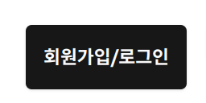
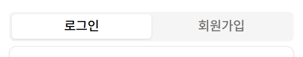
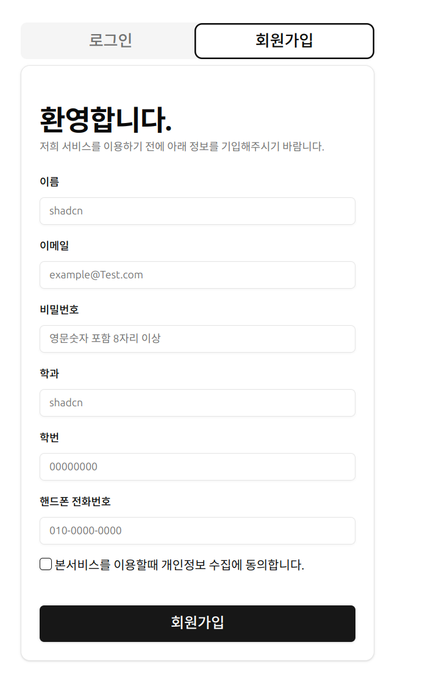

이번 페이지에서는 저희 사이트를 이용하기전 회원가입 하는 방벙을 알려드리겟습니다.

## 회원 가입 페이지 방문
아래에 주소로 들어가거나 이 버튼을 누루고 이동해주세요.
 
DCP: [https://asw-dcp.o-r.kr/site/auth_prcess](https://asw-dcp.o-r.kr/site/auth_prcess) 
ASW: (아직 건설중)  

 
그리고 페이지 들어가면 로그인쪽으로 활성화된 버튼을 회원가입쪽을 눌려서 활성화 해주세요.

## 정보 입력
 
사진에 나와잇는 정보를 다 입력해주세요. 

