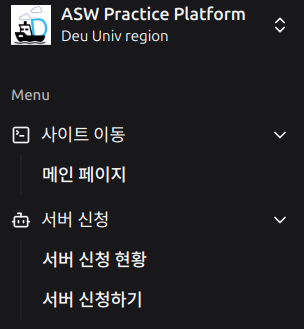
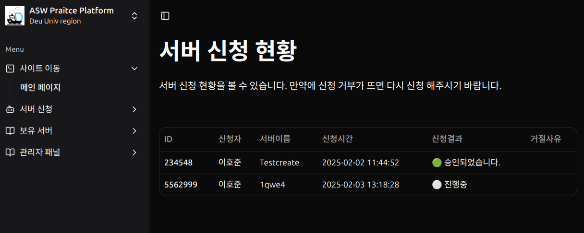
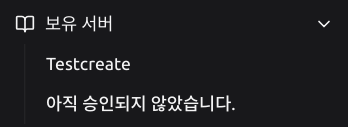
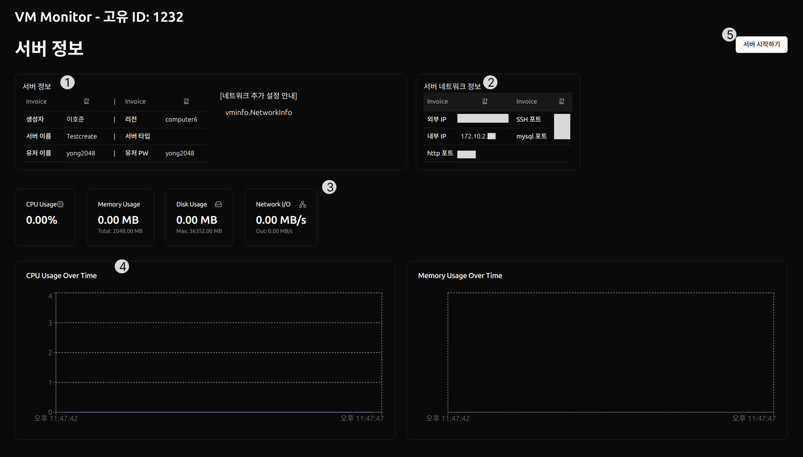

# 서버 신청 현황
서버 신청 현황 같은 경우 데시보드 옆 메뉴바에서 경로 확인이 가능합니다 
 
> 서버 신청 -> 서버 신청 현황

## 나오는 페이지
 
이 페이지에서는 유저가 신청한 서버들의 상황을 볼수 있습니다. 
만약에 서버가 생성이 관리자가 메일로 거절 사유를 보내고 옆에 보이는 거절 사유에도 표시가 됨니다.

> 진행중이라고 표기 되는 경우는 관라자가 제출이후 아무동작을 하지 않있거나 승인은 되었지만 제작중 아닐때 표시가 됨니다.



# 보유 서버
보유 서버를 보는 방법은 옆 메뉴바에서 보실수 있습니다. 
 
위 사진에서 보면 서버 이름이 뜨는 경우가 있고 안뜨는 경우가 있는데. 
### 표시별 상황
- 서버 이름이 정상적으로 뜬다 -> 관리자가 서버 승인을 해서 제작한 경우입니다.
- 제작중입니다 라고 뜬다 -> 관리자가 서버 승인을 했지만 서버를 제작한 경우입니다.
- 아직 승인되지 않았습니다 -> 관리자가 아직 승인을 안한 상태이거나 거절되었을 때 표시가 됨니다. (아래 필독 꼭 한번 볼것!)



# 보유 서버 세부 정보
보유 서버 세부 정보를 보는 방법은 옆 메뉴바에서 자신의 서버 이름이 표시가 되면 클릭하면 접근 할수 있습니다. 
 

## 나오는 페이지
 

지금부터는 번호 대로 설명을 해드리겟습니다.

### 1번 서버 정보
자신이 신청한 정보를 다시 볼수있고 관리자가 네트워크 대해 설명한 코멘트를 볼수 있습니다.

### 2번 서버 네트워크 정보
DCP와 다르게 ASW-PSMT에서는 내부 IP가 자동으로 할당이 되며 학과에서 필요한 실습 기본 포트도 제공이 되어서 화면에 나와있는 포트로 접속 하시면되겟습니다.



CPU, Memory, Disk, Newtwork 사용현황을 하번에 볼수 있습니다. 
>만약에 서버가 꺼진 경우 0으로 표기가 될수 있습니다.

### 3,4번 그래프
CPU나 메모리 같은 경우 그래프를 통해서 어느시간때에 부하가 걸린지 알수 있게 표시 했습니다.일정 초당 API를 받아와서 그래프가 표시됨니다.


### 5번 서버 시작
DCP와 달리 ASW-PSMT에서는 서버를 수동으로 킬수 있습니다.
그래서 서버가 생성되면 처음에는 꺼져 있어서 이 버튼을 눌려주시기 바람니다.

