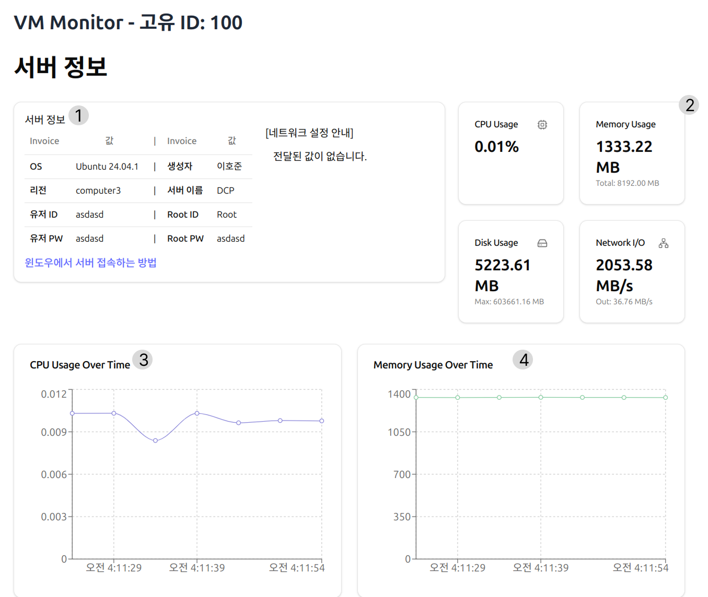

# 서버 신청 현황
서버 신청 현황 같은 경우 아래에 경로에서 확인이 가능합니다
 
> 서버 신청 -> 서버 신청 현황

## 나오는 페이지
 
이 페이지에서는 유저가 신청한 서버들의 상황을 볼수 있습니다. 
만약에 서버가 생성이 관리자가 메일로 거절 사유를 보내고 옆에 보이는 거절 사유에도 표시가 됨니다.



# 보유 서버
보유 서버를 보는 방법은 옆 메뉴바에서 보실수 있습니다. 
 
위 사진에서 보면 서버 이름이 뜨는 경우가 있고 안뜨는 경우가 있는데. 
### 표시별 상황
- 서버 이름이 정상적으로 뜬다 -> 관리자가 서버 승인을 해서 제작한 경우입니다.
- 제작중입니다 라고 뜬다 -> 관리자가 서버 승인을 했지만 서버를 제작한 경우입니다.
- 아직 승인되지 않았습니다 -> 관리자가 아직 승인을 안한 상태이거나 거절되었을 때 표시가 됨니다. (아래 필독 꼭 한번 볼것!)



# 보유 서버 세부 정보
보유 서버 세부 정보를 보는 방법은 옆 메뉴바에서 자신의 서버 이름이 표시가 될때 볼수 있습니다. 

## 나오는 페이지
