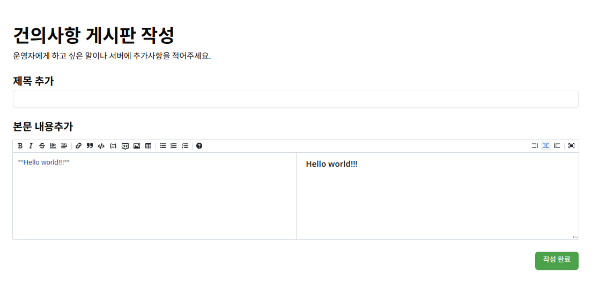




# 건의사항 게시판 작성 가이드 (Markdown 사용법)
<br/>
이 게시판은 **Markdown** 형식을 사용하여 글을 작성할 수 있습니다. Markdown을 사용하면 글을 쉽게 꾸밀 수 있으며, 미리보기 화면에서 결과를 확인할 수 있습니다.

---

## 1. 제목 추가
제목을 추가하려면 `#` 기호를 사용하세요. `#`의 개수에 따라 제목의 크기가 달라집니다.

```markdown
# 제목 1
## 제목 2
### 제목 3
```

미리보기 결과:
# 제목 1
## 제목 2
### 제목 3

---

## 2. 텍스트 강조
- **굵게**: 텍스트를 굵게 표시하려면 `**텍스트**` 또는 `__텍스트__`를 사용하세요.
- *기울임*: 기울임은 `*텍스트*` 또는 `_텍스트_`로 작성하세요.
- ***굵고 기울임***: `***텍스트***`를 사용하면 됩니다.

```markdown
**굵은 텍스트**
*기울인 텍스트*
***굵고 기울인 텍스트***
```

미리보기 결과:
**굵은 텍스트**  
*기울인 텍스트*  
***굵고 기울인 텍스트***

---

## 3. 목록 추가

### ● 순서 없는 목록
`-`, `*`, `+`를 사용하세요.
```markdown
- 항목 1
- 항목 2
  - 하위 항목
```
미리보기 결과:
- 항목 1
- 항목 2
  - 하위 항목

### ● 순서 있는 목록
숫자와 점(`.`)을 사용하세요.
```markdown
1. 첫 번째 항목
2. 두 번째 항목
   1. 하위 항목
```
미리보기 결과:
1. 첫 번째 항목
2. 두 번째 항목
   1. 하위 항목

---

## 4. 링크 추가
웹사이트 링크를 추가하려면 아래 형식을 사용하세요.
```markdown
[링크 텍스트](https://example.com)
```
미리보기 결과: [예시 링크](https://example.com)

---

## 5. 이미지 추가
이미지를 삽입하려면 `` 형식을 사용하세요.
```markdown

```

예시:
```markdown

```

---

## 6. 코드 블록 추가

### ● 인라인 코드
문장 중간에 코드를 표시하려면 `` `코드` ``를 사용하세요.
```markdown
`print('Hello World')`
```
미리보기 결과: `print('Hello World')`

### ● 여러 줄 코드 블록
```markdown
```
여러 줄의 코드
을 이렇게 작성할 수 있습니다.
```
```
미리보기 결과:
```
여러 줄의 코드
을 이렇게 작성할 수 있습니다.
```

---

## 7. 인용구 추가
인용을 추가하려면 `>`를 사용하세요.
```markdown
> 인용문 예시입니다.
```
미리보기 결과:
> 인용문 예시입니다.

---

## 8. 구분선 추가
문단 구분을 위해 `---` 또는 `***`를 사용하세요.
```markdown
---
```
미리보기 결과:
---

---

## 9. 작성 완료
모든 내용을 작성한 후 우측 하단의 **작성 완료** 버튼을 클릭하여 글을 등록하세요.

---

## 🔔 작성 예시
```markdown
# 건의사항
## 제목 추가
**안녕하세요!**
저는 *서비스 개선*에 대한 제안을 드리고자 합니다.

### 제안 내용
1. 홈페이지 속도 개선
2. 사용자 인터페이스 변경

---
> 빠른 검토 부탁드립니다. 감사합니다!
```

미리보기 결과:
# 건의사항
## 제목 추가
**안녕하세요!**  
저는 *서비스 개선*에 대한 제안을 드리고자 합니다.

### 제안 내용
1. 홈페이지 속도 개선
2. 사용자 인터페이스 변경

---
> 빠른 검토 부탁드립니다. 감사합니다!

---

💡 **팁:** 미리보기 창을 활용하여 작성 내용을 바로 확인할 수 있습니다.

