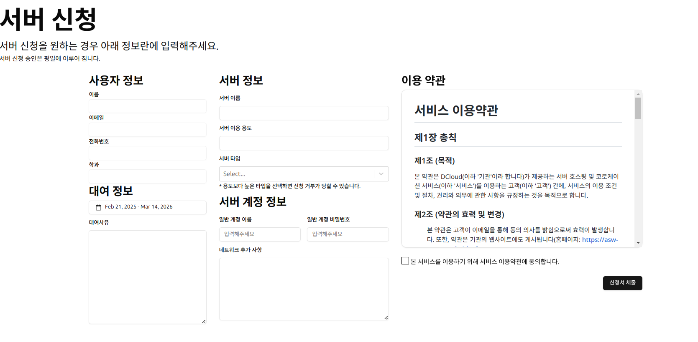
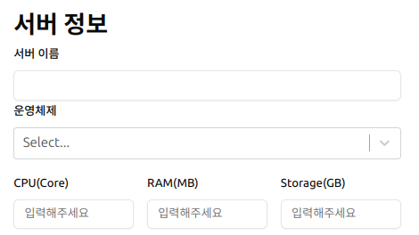
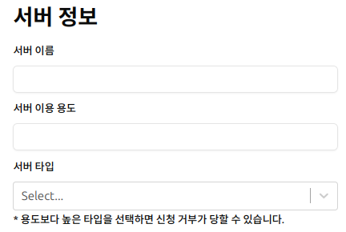
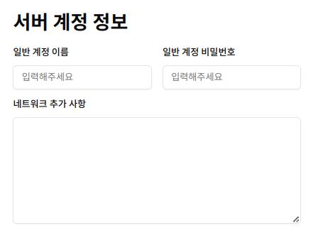



# 페이지 이동 (공통)
메인 페이지에서 서버 신청이라는 버튼을 찾아서 눌려주세요. 
 
이래 페이지로 이동하는지 확인해주세요. 

## DCP 화면
 

## ASW 화면

# 대여 정보 (공통)
 
대여 정보에서 정확한  날짜와 사유를 입력해주세요. 관리자가 심의 할때 유용한 정보로 활용될수 있습니다.



# 서버 정보 (DCP)
  
자신이 필요하는 성능하고 운영체제를 적어주세요.  




# 서버 정보 (ASW)
  
DCP와 다르게 서버타입이 설정이 되어있어서 학과에서 실습하는 정도에 따라서 타입을 설정하시고 서버 이용 용도에 `XXX 과목에 이용할 예정입니다` 라고 적어주세요.


# 서버 계정 정보 (공통)
  
계정 정보는 대문자 말고 소문자로 입력 해주시고 보안이 취약하지 않게 5자리 이상 으로 입력해주시기 바람니다. 
네트워크 추가 사항 같은 경우 필요한 포트를 입력해주면 관리자가 이메일을 통해 결과를 통보해 드리겟습니다.
> ASW같은 경우 기본 적으로 SSH,DB,WEB포트는 NAT으로 다른 포트로 제공해드리고 있습니다.

